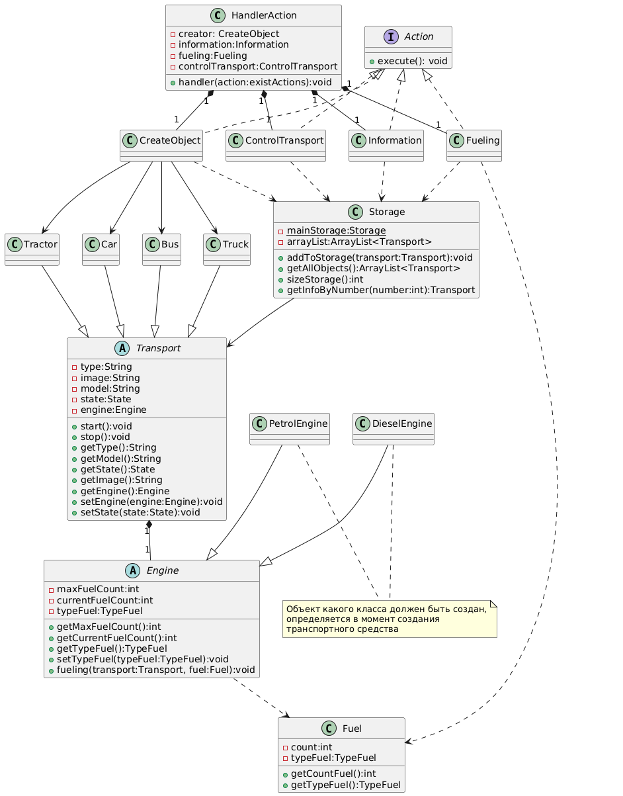

# Описание алгоритма работы
## Инструкция по работе c программой
### Список доступных операций:
#### Создать транспортное средство
   Разрешено создание транспортных средств:
     - Автомобиль,
     - Грузовик,
     - Автобус,
     - Трактор.
   При создании нужно указать модель и максимальный объем топлива.
   Новое созданное транспортное средство будет находиться в состоянии STOP и количество топлива в баке - 0.
#### Показать информацию о созданных транспортных средствах
   Выводит информацию о созданных транспортных средствах.
#### Заправить транспортное средство
   При заправке транспортного средства нужно указать тип топлива и количество литров топлива.
   Также выбрать уже созданное транспортное средство. Нумерация начинается с 0.
   Если тип топлива не совпадает с типом двигателя транспортного средства, то транспортное средство будет сломано.
   Если количество топлива превысит максимально возможный, то заправка только до максимального.
#### Управлять транспортным средством
   Анализируется состояние транспортного средства и количество топлива. Если есть топливо и транспортное средство заправлено или стоит, то оно приводится в движение
   Находящиеся в движении транспортное средство можно остановить.
## Реализация
   В классе HandlerAction создаются и вызываются классы-обработчики каждого пункта меню
   Все обработчики должны имплементировать интерфейс Action.
   Классы-обработчики действий пользователя: CreateObject, Information, Fueling, ControlTransport
#### Создание новых объектов
    Обработка и хранение созданных объектов осуществляется в классе Storage.
    Все создаваемые объекты должны быть разрешенными наследниками запечатанного класса Transport.
    Реализовано 4 финальных наследника-наследника: Car, Bus, Truck, Tractor.
    Абстрактный класс Engine является частью класса Transport(тип связи - композиция).
    Имеет наследников: PetrolEngine, DieselEngine, какой именно должен быть создан определяется в момент создания нового
    транспортного средства.
#### Просмотр информации о созданных объектах
    Выводятся данные из класса Storage.
#### Заправить транспортное средство
     Создается объект класса Fuel. Выбирается транспортное средство. Вызывается метод fueling класса Engine 
     у транспортного средства. В методе обрабатывается тип топлива и его количество, по результатам работы метода 
     атрибут state транспортного средства изменяется.
####  Управлять транспортным средством.
      Создан список допустимых команд для транспортного средства и при выборе команды вызываются методы класса Transport.
 
